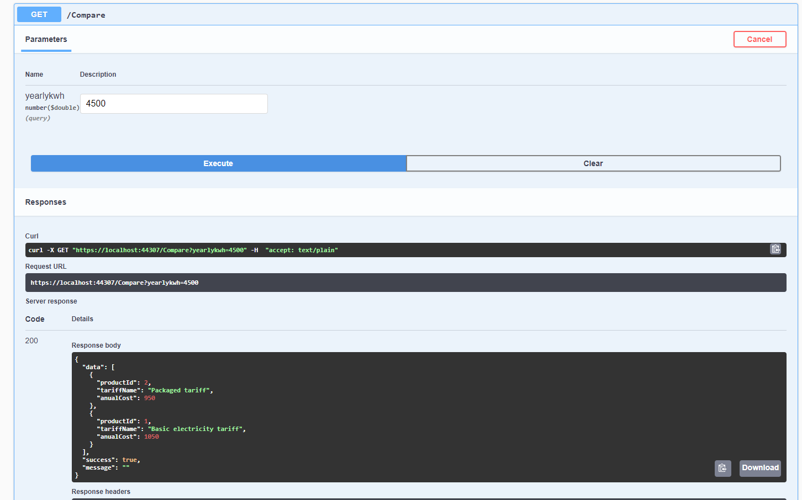

# Yet Another Web Profile (YAWP)
## Getting started

### Requirements

- [Visual Studio 2019](https://visualstudio.microsoft.com/downloads/) 
- [.Net core 5.0](https://dotnet.microsoft.com/download)
- [Visual Studio Code](https://code.visualstudio.com/)
- [Sqlite Client (DBeaver)](https://dbeaver.io/)
- You can work on MacOS, Ubuntu or Windows

### Setup

Go to your terminal and run `src/init.sh`
This will create a local SQLite Database and run the unit tests.
After this step you can open the solution file and run the project.

### Running the project

- Open the solution in Visual Studio and run it. This will launch a swagger page.

- To compare products scroll down to the "/Compare" endpoint.

Experiment with different values changing the input for `yearlykwh` and click on Execute to get the result.
